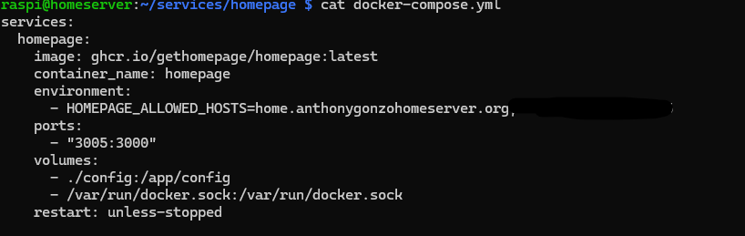
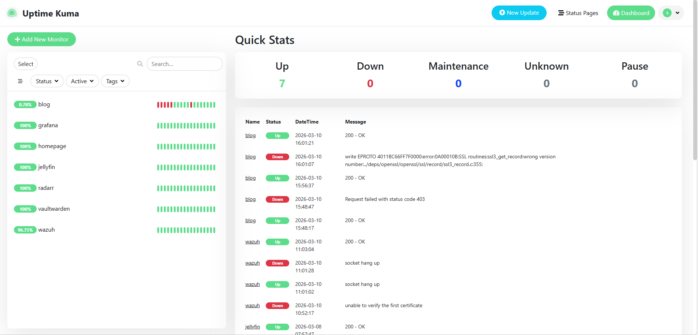
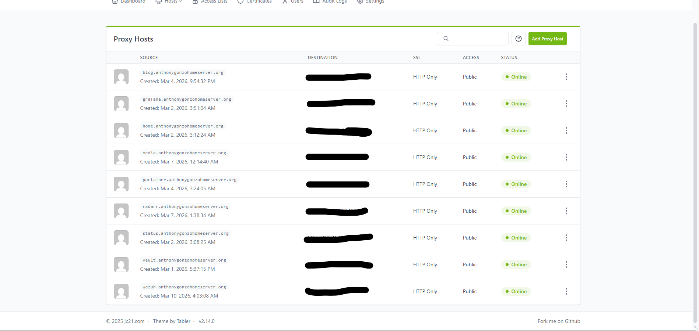
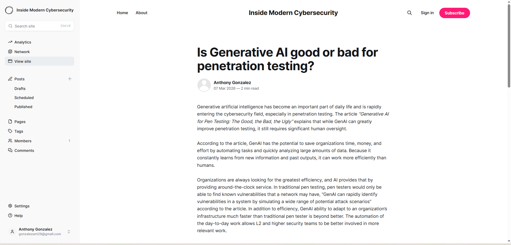

# Self Hosted Cybersecurity Homelab

This project documents my self-hosted cybersecurity homelab built to practice infrastructure management, monitoring, and security tooling.

The environment runs containerized services using Docker on a Linux server.

## Technologies Used

- Linux
- Docker
- Wazuh
- OpenSearch
- Nginx Proxy Manager
- Uptime Kuma
- Cloudflare DNS

## Services Running

- Security monitoring with Wazuh
- Service uptime monitoring with Uptime Kuma
- Reverse proxy management with Nginx Proxy Manager
- Self-hosted blog using Ghost
- Jellyfin media server
- Blog with current cybersecurity insights
- Password Manager with Vaultwarden

## Screenshots

### Docker Compose File

### Uptime Kuma Monitoring

### Nginx Proxy Manager Reverse Proxy

### Self Hosted Cybersecurity Blog

## Network Architecture

To isolate the homelab environment from the primary home network, a secondary router was deployed to create a double NAT configuration. This provides an additional layer of isolation between lab services and the main network.

The lab network hosts a Linux server running multiple Docker containers that provide monitoring, logging, and application services.

A mesh WiFi network was also deployed to provide reliable connectivity across the lab environment.

Key components include:

- ISP Router (primary network gateway)
- Secondary Router (lab network isolation via double NAT)
- Ubuntu Server and Raspberry Pi running Docker services
- Nginx Proxy Manager for reverse proxy management
- Uptime Kuma for service monitoring
- Wazuh for security monitoring
- Mesh WiFi nodes for expanded coverage

## Skills Demonstrated

- Docker container deployment
- Reverse proxy configuration
- Security monitoring infrastructure
- Log analysis and monitoring
- Self-hosted service management

- ## What I Learned

- Deploying containerized services with Docker
- Configuring a reverse proxy for internal applications
- Monitoring service uptime and reliability
- Managing a self-hosted infrastructure environment
- Understanding security monitoring concepts

- ## Future Improvements

- Implement automated backups
- Add network segmentation
- Expand SIEM log ingestion
- Integrate additional security monitoring tools
